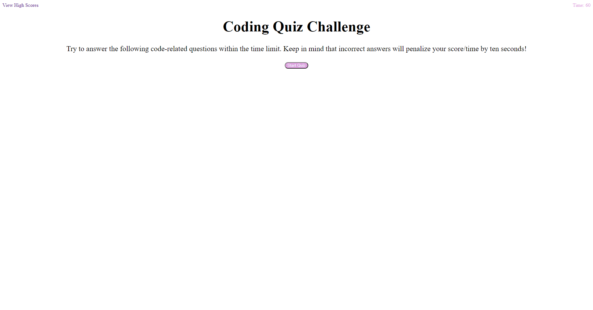

# Web APIs Challenge: Code Quiz
[](https://bootcamp.msu.edu/)

## Technologies


## Description
Our tasks for the challenge is to create a timed coding quiz with multiple-choice questions.  The application will run in the browser and feature dynamically updated HTML and CSS.  The application will also be powered by JavaScript written by me and have a responsive user interface.

## User Story
```
AS A coding boot camp student
I WANT to take a timed quiz on JavaScript fundamentals that stores high scores
SO THAT I can gauge my progress compared to my peers
```

## Acceptance Criteria
```
GIVEN I am taking a code quiz
WHEN I click the start button
THEN a timer starts and I am presented with a question
WHEN I answer a question
THEN I am presented with another question
WHEN I answer a question incorrectly
THEN time is subtracted from the clock
WHEN all questions are answered or the timer reaches 0
THEN the game is over
WHEN the game is over
THEN I can save my initials and score
```

## Screenshot
Here is a preview of the website before the application starts: 
Here is a preview of the website after the application ends: 

## Link
A link to the [code](https://github.com/jgarcia45/code-quiz):
```
https://github.com/jgarcia45/code-quiz
```

A link to the deployed [URL](https://jgarcia45.github.io/code-quiz/):
```
https://jgarcia45.github.io/code-quiz/
``` 